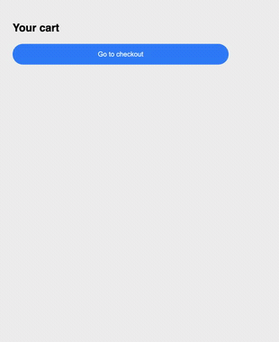
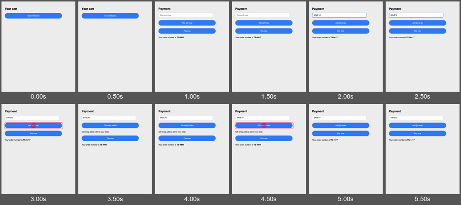

# walkthrough-recorder

[](https://github.com/geofflittle/walkthrough-recorder/actions/workflows/ci.yml)

Drives a Chrome extension through a scripted walkthrough, records it, and grades
the recording. Failed checks fail the command.



## Usage

```ts
import { finishRun, recordTake, runFromTake } from 'walkthrough-recorder';
import type { Step } from 'walkthrough-recorder';

type Ref = 'discountCode' | 'orderNumber';

const script: Step<Ref>[] = [
  { do: 'click', target: 'shop-cart-primary' },
  { do: 'awaitScreen', target: 'shop-pay-step' },
  {
    do: 'capture',
    as: 'orderNumber',
    wordTemplate: 'shop-order-{index}',
    count: 1,
  },
  { do: 'type', target: 'shop-code-value', value: 'discountCode' },
  { do: 'click', target: 'shop-pay-primary' },
];

const result = await recordTake({
  script,
  bindings: { discountCode: 'SAVE10' },
  finishHoldMs: 800,
  app: {
    extensionPath: './extension',
    viewport: { width: 620, height: 760 },
    screenPattern: /^shop-.*-step$|^shop-checkout-ok$/,
    arrivesUnprompted: ['shop-cart-step'],
    providerUrls: '**/api/**',
    submitPattern: /\/api\/orders$/,
    terminalScreens: [
      { name: 'checkout-done', testId: 'shop-checkout-ok' },
      { name: 'abandoned', testId: 'shop-cart-step' },
    ],
    entryPath: 'shop.html',
    readyTestId: 'shop-cart-primary',
    plausibleSeconds: { least: 5, most: 60 },
    mustLearn: [{ ref: 'orderNumber', whyItMatters: 'it is the only receipt' }],
  },
  profileDir: './.profile',
  recordVideoDir: '.',
  videoPath: './shop.mp4',
});

finishRun(runFromTake(result));
```

`npm run example:shop` runs that against the bundled example extension.

## Steps

`click`, `type`, `paste`, `setClipboard`, `scrollTo`, `awaitScreen`, `hold`,
`capture` (reads text off the page into a named value), and `ifPresent` (a
sub-sequence that runs only if a control appears).

Targets are `data-testid` values.

## Output

`shop.mp4`, and beside it:

`shop.timeline.txt`, the transcript, timestamped against the video.

```
00:00.0  ready shop-cart-primary (0.0s)
00:00.9  click shop-cart-primary
00:01.3  enter shop-pay-step (0.0s)
00:01.3  note  shop-pay-step painted 760px
00:01.3  ready shop-code-value (0.0s)
00:01.9  type  shop-code-value (0.3s) 6 chars
00:02.2  ready shop-gift-toggle (0.0s)
00:03.2  click shop-gift-toggle
00:03.5  ready shop-gift-toggle (0.0s)
00:04.4  click shop-gift-toggle
00:04.8  ready shop-pay-primary (0.0s)
00:05.7  click shop-pay-primary
00:06.1  wait  linger (0.8s) reading the outcome
```

`shop.takes.jsonl`, one line appended per take.

```json
{
  "runAtEpochMs": 1787161353866,
  "host": { "load": [7.99, 6.95, 8.09], "cpus": 10 },
  "video": { "width": 620, "height": 760, "durationSeconds": 11.36 },
  "terminalState": "checkout-done",
  "failedChecks": [],
  "spans": { "type shop-code-value": 289, "wait linger": 800 },
  "lastEventMs": 6154
}
```

Every press is drawn onto the video by an init script in the page, which listens
for `pointerdown` and removes the mark when its target leaves the DOM.

`contactSheets` tiles frames into labelled grids. The pink outlines are press
marks.



## Checks

Each take is graded against these. Any that fail are printed and set a non-zero
exit code.

```
frame is 620x760
no backdrop band along the bottom
reached its checkout-done screen
holds on the final screen after the last action
transcript ends within the video
runs for a plausible length (5 to 60s)
every click was seen by the page
every screen was reached by clicking something
every click landed on a target that was still there
every press was visible for 320ms before its screen changed
walkthrough performed every step in order
every control was pressed as often as the script asked
the page reported its screen changes
the page reported the presses the script asked for
```

## API

- `recordTake` drives, records and grades one take.
- `runSession` wraps a take in setup and teardown, prints any captured value
  before anything else can fail, checks the result against the world outside the
  app, and calls your `discardWorkspace` once teardown reports success.
- `finishRun` prints a result and sets the exit code.
- `contactSheets` tiles video frames into labelled grids.
- `appendTake` and `compareTakes` read and write `.takes.jsonl`.

The library writes files and never removes them.

## Requirements

Node (see `.nvmrc`), Playwright, `ffmpeg`, `ffprobe`, and ImageMagick's
`montage` for contact sheets.

The extension must register a service worker. Its id is read from that URL.

## Licence

MIT
